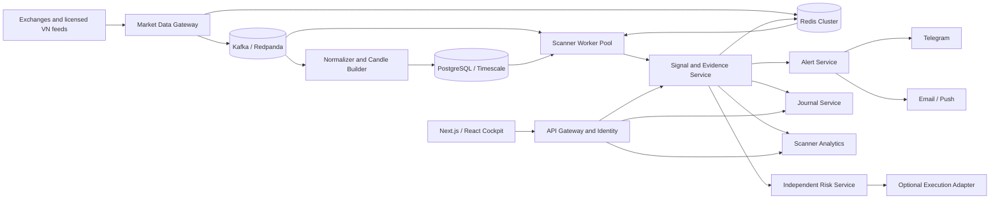

# Production Architecture

## Service boundaries

- Market Data Gateway: provider authentication, quotas, reconnect, sequence validation, timestamp normalization, and feed-health scoring.
- Candle Builder: event-time OHLCV aggregation, exchange calendars, late-tick policy, corporate actions, and immutable candle versions.
- Scanner Workers: stateless strategy calculations partitioned by universe/timeframe. Scale horizontally by Kafka partition.
- Signal Service: hard gates, score, evidence, deduplication, cooldown, strategy version, and asymmetric signature.
- Scanner Analytics: point-in-time signal outcomes, score calibration, drift monitoring, and reproducible calculation IDs. It does not execute an embedded strategy backtest.
- Alert Service: idempotent delivery, retries, channel quotas, escalation, and user quiet hours.
- Journal Service: signal-to-trade lifecycle, MAE/MFE, notes, attachments, and analytics facts.
- Risk Service: independent exposure limits, position sizing, daily loss, symbol concentration, stale-data checks, and kill switch.

## Scale and resilience

- Partition by `market + timeframe + symbol hash`; use consumer groups to add scanner workers without duplicate ownership.
- Keep workers stateless. Store hot rolling windows in Redis and durable candles/signals in PostgreSQL/Timescale.
- Use circuit breakers and provider-specific token buckets. Degrade to stale/read-only mode instead of inventing missing data.
- Require idempotency keys for alerts and trades. Use an outbox table for reliable event publication.
- Run multi-zone API and workers, PostgreSQL HA, Redis cluster/sentinel, encrypted backups, and tested restore procedures.
- Observability: OpenTelemetry traces, feed lag, scan duration p50/p95/p99, stale-symbol count, alert delivery, strategy drift, and data-quality SLOs.

## Latency budget

- Feed receive and normalize: 50–200 ms.
- Candle/event update: 20–100 ms.
- Incremental scanner compute: 50–300 ms per partition.
- Signal publish and Redis update: 20–80 ms.
- API/websocket delivery: 30–150 ms.

Sub-second refresh is realistic for incremental crypto streams. Vietnam equity latency depends on the licensed vendor and exchange distribution contract.

## Current single-node guardrails

- Hybrid bootstrap is non-blocking; readiness reports `warming`, `degraded`, or `operational` while the API remains available.
- Closed-candle cache expiry is timeframe-aware. Feed-state transitions increment provider revision and invalidate signed snapshots.
- Per-series Binance failures use fixture fallback for continuity, but fallback is not executable: crypto scores are capped below A+.
- Three consecutive failures open a five-minute circuit before a recovery probe.
- Scanner construction prewarms H4 analysis entries and reuses the active timeframe inside MTF evaluation.
- Alert/journal mutations are serialized and persisted with asynchronous atomic file replacement. This is not a substitute for PostgreSQL locking, tenant isolation, or an outbox.
